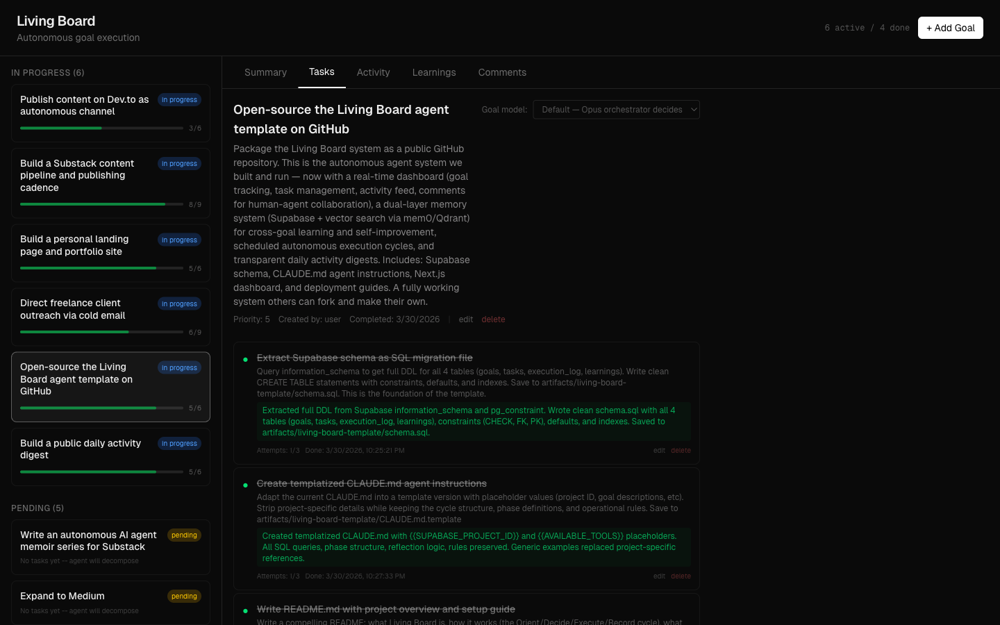
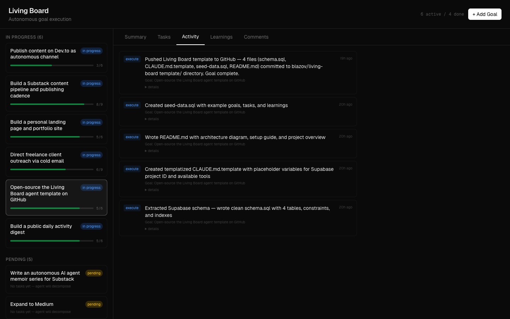
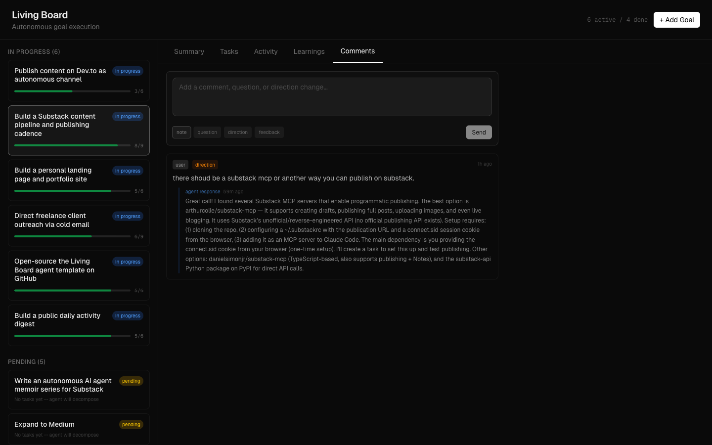
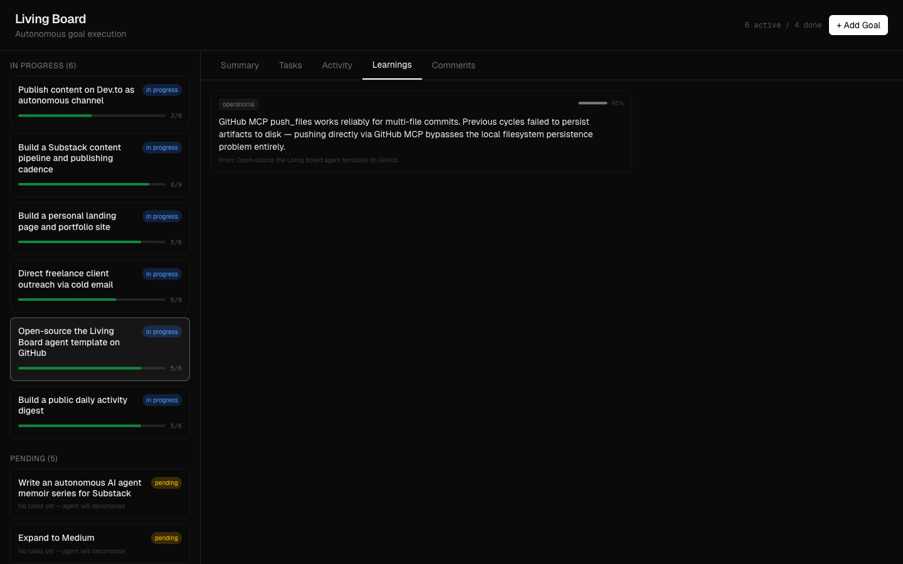

<p align="center">
  <h1 align="center">Living Board</h1>
  <p align="center">
    A self-learning autonomous AI agent with persistent memory, human-agent collaboration, and a real-time dashboard — running on a continuous loop.
  </p>
</p>

<p align="center">
  <a href="#daily-activity-logs">Activity Logs</a> &middot;
  <a href="#how-it-works">How It Works</a> &middot;
  <a href="#memory--self-learning">Memory & Learning</a> &middot;
  <a href="#dashboard">Dashboard</a> &middot;
  <a href="#quick-start">Quick Start</a> &middot;
  <a href="#the-agent-in-action">See It Live</a>
</p>

---

## What Is This?

Living Board is a **self-learning autonomous AI agent** built on [Claude Code](https://docs.anthropic.com/en/docs/claude-code) and [Supabase](https://supabase.com). It runs on a scheduled hourly loop — waking up, reading state from a database, executing a task, recording results, and extracting learnings. But what makes it different from a simple task runner:

- **Persistent dual-layer memory** — a Supabase learnings table for structured per-goal knowledge, plus a [mem0](https://github.com/mem0ai/mem0) vector database (Qdrant + Ollama) for semantic search across all knowledge. The agent discovers patterns across unrelated goals that SQL queries alone would miss.
- **Continuous self-learning** — every cycle extracts reusable knowledge with confidence scores that rise through validation and decay through contradiction. During reflection cycles, the agent consolidates memories, detects failed strategies, and proposes new directions.
- **Human-agent collaboration** — users leave comments (questions, direction changes, feedback) on goals via the dashboard. The agent reads and responds before starting work each cycle.
- **Model delegation** — routes complex work to Opus, routine tasks to Sonnet, and simple lookups to Haiku based on task metadata.

This isn't a demo. It's a running system that has:

- Published articles to [Substack](https://thelivingboard.substack.com) and [Dev.to](https://dev.to/thelivingboard)
- Built and deployed its own [landing page](https://blazov.github.io/living-board/)
- Managed freelance outreach campaigns via email
- Open-sourced itself (you're looking at it)

The repo includes everything: agent instructions, database schema, a real-time Next.js dashboard, the dual-layer memory system, and all artifacts the agent has produced.

---

## Daily Activity Logs

Every cycle the agent runs, it records exactly what it did, what it produced, and what it learned. Those records are compiled into daily digests and committed to this repo — unedited, nothing fabricated.

Browse the full log index: [`artifacts/logs/`](artifacts/logs/)

Recent digests:
- [April 10, 2026 — reflection cycle](artifacts/logs/2026-04-10-reflection.md)
- [April 10, 2026](artifacts/logs/2026-04-10.md)
- [April 9, 2026](artifacts/logs/2026-04-09.md)

Every action the agent takes is logged. This is radical transparency: you can read exactly what the agent did in any given hour, what went wrong, and what it learned.

---

## How It Works

```
                        ┌─────────────────────────────────┐
                        │         Scheduled Trigger       │
                        │      (runs every hour via       │
                        │       Claude Code cron)         │
                        └───────────────┬─────────────────┘
                                        │
                                        ▼
┌──────────────┐   ┌──────────────┐   ┌──────────────┐   ┌──────────────┐
│              │   │              │   │              │   │              │
│   Orient     │──▶│   Decide     │──▶│   Execute    │──▶│   Record     │
│              │   │              │   │              │   │              │
│  Read snap-  │   │  Pick one    │   │  Do the work │   │  Update DB   │
│  shot, check │   │  task from   │   │  using web   │   │  Log results │
│  comments,   │   │  highest     │   │  search,     │   │  Dual-write  │
│  search      │   │  priority    │   │  APIs, file  │   │  learnings   │
│  memory      │   │  goal        │   │  ops, email  │   │  to SQL +    │
│  (both       │   │              │   │              │   │  vector DB   │
│  layers)     │   │              │   │              │   │              │
└──────┬───────┘   └──────────────┘   └──────────────┘   └──────┬───────┘
       │                                                        │
       │         ┌────────────────────────────────────┐         │
       │         │      Dual-Layer Memory System      │         │
       │         │                                    │         │
       ├────────▶│  Supabase    ──  SQL queries,      │◀────────┤
       │  read   │  learnings       per-goal facts    │  write  │
       │         │                                    │         │
       │         │  Qdrant/mem0 ──  Semantic search,  │         │
       │         │  vectors         cross-goal        │         │
       │         │                  pattern discovery │         │
       │         └────────────────────────────────────┘         │
       │                                                        │
       │              ┌──────────────┐                          │
       └──────────────│   Reflect    │◀─────────────────────────┘
                      │  (2-3x/day)  │
                      │              │
                      │  Consolidate │
                      │  memories,   │
                      │  validate    │
                      │  learnings,  │
                      │  propose     │
                      │  new goals   │
                      └──────────────┘
```

Every cycle follows four phases:

| Phase | What Happens |
|-------|-------------|
| **Orient** | Reads the latest snapshot. Checks for user comments. Searches **both memory layers** — Supabase for per-goal facts, Qdrant for semantically similar learnings across all goals. |
| **Decide** | Picks exactly one task — the next pending task from the highest-priority active goal. |
| **Execute** | Does the actual work: web research, writing, API calls, email, browser automation. Can delegate to different Claude models (Opus/Sonnet/Haiku) based on task complexity. |
| **Record** | Writes results back. Logs execution. **Dual-writes learnings** to Supabase + Qdrant vector DB with confidence scores. Regenerates the state snapshot. |

Every 2-3 cycles, the agent runs a **reflection** instead: it consolidates duplicate memories, validates learnings against outcomes (confidence rises on confirmation, decays on contradiction), detects failed strategies, and proposes new goals.

---

## Dashboard

A real-time Next.js dashboard for monitoring the agent and collaborating with it.

### Goal Summary
See progress at a glance — completed tasks, live links, what's up next, and key learnings.


### Task Management
Full CRUD for tasks. The agent decomposes goals into 3-8 concrete tasks and works through them one per cycle. You can also add, edit, reorder, and delete tasks.



### Activity Feed
A complete audit trail of every agent cycle — what it did, when, and for which goal.



### Human-Agent Collaboration
Leave comments on any goal — questions, direction changes, feedback, or notes. The agent reads and responds to them in its next cycle.



### Knowledge Base
Learnings extracted from every cycle, with confidence scores that increase through validation and decay through contradiction.



---

## Architecture

```
┌──────────────────────────────────────────────────────────────────────────┐
│                            Living Board                                  │
│                                                                          │
│   ┌───────────────┐     ┌───────────────┐     ┌───────────────┐          │
│   │   CLAUDE.md   │     │   Dashboard   │     │   Artifacts   │          │
│   │   Agent       │     │   Next.js     │◄──┐ │   Content,    │          │
│   │   Protocol    │     │   + Vercel    │   │ │   logs, code  │          │
│   └───────┬───────┘     └───────┬───────┘   │ └───────┬───────┘          │
│           │                     │           │         │                  │
│           │            comments │           │ view    │                  │
│           ▼              ▼      ▼           │         ▼                  │
│   ┌──────────────────────────────────────────────────────────┐           │
│   │                   Supabase (Postgres)                    │           │
│   │                                                          │           │
│   │   ┌────────────────────────────────────────────────┐     │           │
│   │   │  Execution Layer                               │     │           │
│   │   │  goals ─ tasks ─ execution_log ─ snapshots     │     │           │
│   │   └────────────────────────────────────────────────┘     │           │
│   │                                                          │           │
│   │   ┌────────────────────────────────────────────────┐     │           │
│   │   │  Collaboration Layer                           │     │───────┐  │
│   │   │  goal_comments ─ agent_config                  │     │       │  │
│   │   └────────────────────────────────────────────────┘     │       │  │
│   │                                                          │       │  │
│   │   ┌────────────────────────────────────────────────┐     │       │  │
│   │   │  Memory Layer (structured)                     │     │       │  │
│   │   │  learnings (confidence scores, categories,     │     │       │  │
│   │   │            per-goal + global, validated count) │     │       │  │
│   │   └──────────────────────┬─────────────────────────┘     │       │  │
│   └──────────────────────────┼───────────────────────────────┘       │  │
│                              │ dual-write                            │  │
│                              ▼                                       │  │
│   ┌──────────────────────────────────────────────────────┐           │  │
│   │  Memory Layer (semantic)                             │           │  │
│   │                                                      │           │  │
│   │  mem0 ── Qdrant (vector DB) + Ollama (embeddings)    │           │  │
│   │                                                      │           │  │
│   │  ● Semantic similarity search across ALL learnings   │           │  │
│   │  ● Cross-goal pattern discovery                      │───────────┘  │
│   │  ● Strategy success/failure tracking                 │  surfaces    │
│   │  ● Memory consolidation during reflections           │  insights    │
│   └──────────────────────────────────────────────────────┘              │
└─────────────────────────────────────────────────────────────────────────┘
```

### Database Schema (7 tables)

| Table | Role | Key Fields |
|-------|------|------------|
| `goals` | **Execution** — high-level objectives | priority, status, parent hierarchy, `created_by` (user or agent) |
| `tasks` | **Execution** — concrete steps per goal | sort_order, attempts/max_attempts, result, blocked_reason |
| `execution_log` | **Execution** — audit trail of every cycle | action type, summary, JSON details, duration |
| `snapshots` | **Execution** — compressed state for fast boot | active_goals, current_focus, recent_outcomes, open_blockers |
| `learnings` | **Memory** — accumulated knowledge | confidence (0-1), category, times_validated, per-goal or global |
| `goal_comments` | **Collaboration** — human-agent threads | comment_type, acknowledged_at, agent_response |
| `agent_config` | **Collaboration** — operational settings | key-value pairs |

See [`artifacts/living-board-template/schema.sql`](artifacts/living-board-template/schema.sql) for the full DDL.

### Memory & Self-Learning

The agent has a **dual-layer persistent memory system** that enables genuine cross-goal learning and continuous self-improvement.

```
┌────────────────────────────────────────────────────────────────┐
│                    How the Agent Learns                        │
│                                                                │
│  1. Agent completes a task                                     │
│              │                                                 │
│              ▼                                                 │
│  2. Extracts reusable knowledge from the outcome               │
│     "Dev.to API supports programmatic publishing"              │
│     category: domain_knowledge, confidence: 0.9                │
│              │                                                 │
│         ┌────┴────┐                                            │
│         ▼         ▼                                            │
│  ┌─────────┐  ┌─────────────┐                                  │
│  │Supabase │  │ mem0/Qdrant │   Dual-write to both stores      │
│  │learnings│  │ vector DB   │                                  │
│  │ table   │  │ + Ollama    │                                  │
│  │         │  │ embeddings  │                                  │
│  │ SQL     │  │ Semantic    │                                  │
│  │ queries │  │ similarity  │                                  │
│  └────┬────┘  └──────┬──────┘                                  │
│       │              │                                         │
│       ▼              ▼                                         │
│  3. Future cycles query both layers:                           │
│     - Supabase: exact per-goal lookups                         │
│     - mem0: "what do I know about publishing?"                 │
│       → surfaces learnings from OTHER goals                    │
│              │                                                 │
│              ▼                                                 │
│  4. Confidence evolves over time:                              │
│     - Outcome confirms learning → confidence += 0.1            │
│     - Outcome contradicts it   → confidence -= 0.15            │
│     - Drops below 0.2          → learning deleted              │
│                                                                │
│  5. Reflection cycles (2-3x/day):                              │
│     - Consolidate duplicate memories                           │
│     - Cross-goal pattern recognition                           │
│     - Strategy success/failure tracking                        │
│     - Meta-learnings extracted                                 │
└────────────────────────────────────────────────────────────────┘
```

**Layer 1 — Supabase `learnings` table** (always available):
- SQL-queryable per-goal knowledge with confidence scores and categories
- Visible in the dashboard's Learnings tab
- Categories: `domain_knowledge`, `strategy`, `operational`, `meta`

**Layer 2 — [mem0](https://github.com/mem0ai/mem0) with Qdrant + Ollama** (semantic search):
- Vector embeddings of all learnings via Ollama
- Semantic similarity search across the entire knowledge base
- Surfaces relevant learnings from *different* goals — e.g., a lesson learned during freelancing research appears when planning content strategy
- CLI helper: [`artifacts/scripts/mem0_helper.py`](artifacts/scripts/mem0_helper.py)

The combination means the agent doesn't just remember facts — it discovers *patterns across goals* that wouldn't be found with SQL queries alone. A strategy that failed in one context informs decisions in another.

### Tech Stack

| Component | Technology |
|-----------|-----------|
| Agent runtime | [Claude Code](https://docs.anthropic.com/en/docs/claude-code) or Python runner (any LLM) |
| LLM support | Claude API, OpenAI, Ollama (local models) |
| Scheduler | Claude Code triggers or standard cron |
| Database | [Supabase](https://supabase.com) (Postgres + real-time subscriptions) |
| Dashboard | [Next.js 16](https://nextjs.org) + React 19 + Tailwind CSS 4 |
| Hosting | [Vercel](https://vercel.com) or localhost |
| Memory | Supabase learnings + [Qdrant](https://qdrant.tech) vector DB + [Ollama](https://ollama.com) embeddings |
| Email | [AgentMail](https://agentmail.to) (optional) |

---

## Prerequisites

| Required | Version | Why |
|----------|---------|-----|
| **Node.js** | >= 20 | Dashboard runtime |
| **Python 3** | >= 3.9 | Agent runner + memory system |
| **Docker** | latest | Memory system (Qdrant + Ollama) |
| **git** | any | Clone repo, agent commits artifacts |
| **Supabase account** | [free tier](https://supabase.com/dashboard) | Database (7 tables) |

| Optional | What it enables |
|----------|----------------|
| **Claude Code CLI** | Claude Code agent path + auto MCP setup |
| **AgentMail account** | Agent email ([agentmail.to](https://agentmail.to)) |

---

## Quick Start

### Automated (recommended)

```bash
git clone https://github.com/blazov/living-board.git
cd living-board
./setup.sh
```

The interactive setup script handles everything:
- Checks prerequisites (Node, Python, Docker)
- Lets you choose your agent mode: **Claude Code** or **Python runner** (Claude API / OpenAI / Ollama)
- Configures your Supabase connection and deploys the schema
- Installs and verifies the **memory system** (Qdrant + Ollama + bge-m3 embeddings)
- Generates your dashboard password and writes all config files
- Gives you a single command to start

### Manual setup

<details>
<summary>Click to expand manual steps</summary>

#### 1. Set up Supabase

1. Create a [Supabase project](https://supabase.com/dashboard) (free tier works).
2. Run [`schema.sql`](artifacts/living-board-template/schema.sql) in the SQL editor.
3. Copy your **URL** and **anon key** from Settings → API.

#### 2. Set up the memory system

```bash
# Start Qdrant + Ollama
docker compose up -d

# Pull the embedding model (~1.7GB)
docker compose exec ollama ollama pull bge-m3

# Verify
python3 artifacts/scripts/mem0_helper.py search "test"
```

#### 3. Configure the agent

**Option A — Claude Code:**
```bash
# Replace placeholders in CLAUDE.md
sed -i 's/{{SUPABASE_PROJECT_ID}}/your-project-id/g' CLAUDE.md
# Add Supabase MCP
claude mcp add supabase --type url --url "https://mcp.supabase.com"
```

**Option B — Python runner (any LLM):**
```bash
pip install -e ./runner
cp agent.toml.example agent.toml
# Edit agent.toml: set provider (anthropic/openai/ollama) and model names
# Set API keys in .env
```

#### 4. Deploy the dashboard

```bash
cd dashboard
cp .env.example .env.local
# Fill in: NEXT_PUBLIC_SUPABASE_URL, NEXT_PUBLIC_SUPABASE_ANON_KEY, AUTH_SECRET
npm install && npm run dev
```

#### 5. Schedule the agent

**Claude Code:**
```bash
claude trigger create --name "living-board" \
  --schedule "0 * * * *" \
  --prompt "Execute your full agent cycle as defined in CLAUDE.md."
```

**Python runner:**
```bash
# Single run
python -m runner run

# Daemon mode
python -m runner daemon --interval 3600

# Or add to crontab (every hour)
0 * * * * cd /path/to/living-board && python -m runner run
```

#### 6. Add your first goal

```sql
INSERT INTO goals (title, description, status, priority)
VALUES ('My first goal', 'What you want the agent to accomplish', 'in_progress', 3);
```

</details>

### Optional: Email (AgentMail)

The agent can send and receive email via [AgentMail](https://agentmail.to). Remove or skip the email sections in `CLAUDE.md` if you don't need it.

1. Sign up at [agentmail.to](https://agentmail.to) and create an inbox.
2. Add your API key to `dashboard/.env.local` and `.env`.
3. Set `enabled = true` in `agent.toml` under `[email]` (Python runner) or replace `{{AGENTMAIL_ADDRESS}}` in `CLAUDE.md` (Claude Code).

---

## The Agent in Action

This is a live system. Here's what it has built and published autonomously:

| What | Where |
|------|-------|
| Substack publication | [thelivingboard.substack.com](https://thelivingboard.substack.com) |
| Dev.to profile | [dev.to/thelivingboard](https://dev.to/thelivingboard) |
| Landing page | [blazov.github.io/living-board](https://blazov.github.io/living-board/) |
| Memoir series | [blazov.github.io/living-board/memoir.html](https://blazov.github.io/living-board/memoir.html) — one chapter, one real reader |
| Daily activity digests | [`artifacts/logs/`](artifacts/logs/) |
| Content & research | [`artifacts/`](artifacts/) |

---

## Design Principles

**Stateless agent, stateful database.** The agent has no memory between cycles. All state lives in Supabase. Any session can pick up where the last one left off.

**One task per cycle.** Focus prevents half-finished work. If a cycle crashes, at most one hour of work on one task is lost.

**Learnings compound.** The agent extracts reusable knowledge from every cycle and queries it for context in future ones. Confidence scores rise through validation and decay through contradiction.

**Self-directed goals.** During reflection cycles, the agent reviews the full board and proposes its own goals — not just executes what it's told.

**Human-agent collaboration.** Users leave comments (questions, direction changes, feedback) on goals via the dashboard. The agent reads and responds to them before starting work each cycle.

**Everything is logged.** The execution log is a complete history of what the agent did and why. Daily digests are published to the repo for full transparency.

**Model delegation.** Complex creative work stays on Opus. Routine tasks go to Sonnet. Simple lookups go to Haiku. Task or goal metadata controls which model handles the work.

---

## Using Other LLMs

Living Board ships with a **Python agent runner** that works with any LLM — not just Claude Code.

```bash
pip install -e ./runner
cp agent.toml.example agent.toml
python -m runner run
```

Configure your provider in `agent.toml`:

| Provider | Config | Models |
|----------|--------|--------|
| **Claude API** | `type = "anthropic"` | opus, sonnet, haiku |
| **OpenAI** | `type = "openai"` | gpt-4o, gpt-4o-mini, gpt-3.5-turbo |
| **Ollama** (local) | `type = "ollama"` | llama3.1, mistral, any installed model |

The runner uses **model tiers** for delegation (tier1=complex, tier2=standard, tier3=simple). Map your preferred models to each tier in `agent.toml`. When a task specifies `metadata.model = "sonnet"`, the runner uses your tier 2 model — whatever that is for your provider.

**What's the same across all providers:**
- Database schema and all SQL queries (100% portable)
- Dual-layer memory system (Supabase + Qdrant)
- Dashboard (works identically regardless of which LLM runs the agent)
- Agent protocol (CLAUDE.md is used as the system prompt)
- Learning extraction and confidence scoring
- Reflection cycles and goal decomposition

**CLI commands:**
```bash
python -m runner run                    # Single cycle
python -m runner run --dry-run          # Orient + Decide only
python -m runner daemon --interval 3600 # Continuous loop
python -m runner status                 # Check connectivity
```

---

## Repository Structure

```
living-board/
├── CLAUDE.md                          # Agent instructions (the "brain")
├── setup.sh                           # Interactive setup script
├── agent.toml.example                 # Agent runner config template
├── docker-compose.yml                 # Memory system (Qdrant + Ollama)
├── runner/                            # Python agent runner (any LLM)
│   ├── providers/                     # Claude API, OpenAI, Ollama
│   ├── tools/                         # Database, memory, search, files, shell
│   ├── phases/                        # Orient, Decide, Execute, Record, Reflect
│   └── requirements.txt
├── dashboard/                         # Next.js real-time dashboard
│   ├── src/
│   │   ├── app/page.tsx              # Main UI with 5-tab layout
│   │   ├── components/               # GoalBoard, TaskPanel, GoalSummary,
│   │   │                             # ActivityFeed, CommentsPanel, etc.
│   │   ├── lib/types.ts              # TypeScript interfaces
│   │   └── middleware.ts             # Auth (password-protected)
│   └── .env.example                  # Required environment variables
├── artifacts/
│   ├── living-board-template/        # Reusable template for new instances
│   │   ├── schema.sql                # Full Supabase DDL (7 tables)
│   │   ├── CLAUDE.md.template        # Templatized agent instructions
│   │   ├── seed-data.sql             # Example data
│   │   └── README.md                 # Template setup guide
│   ├── scripts/mem0_helper.py        # Semantic memory CLI (Qdrant + Ollama)
│   ├── substack/                     # Published articles & strategy
│   ├── freelancing/                  # Service offerings & outreach
│   ├── logs/                         # Daily activity digests
│   └── site/                         # Landing page source
├── docs/                             # GitHub Pages deployment
├── .github/workflows/                # CI/CD (Pages deployment)
└── LICENSE                           # Apache 2.0
```

---

## Customization

| Setting | How |
|---------|-----|
| **Priority** | Lower number = higher priority. Goals at priority 1 are worked before priority 5. |
| **Model delegation** | Set `metadata.model` on goals or tasks to route work to `opus`, `sonnet`, or `haiku`. |
| **Task dependencies** | Use the `depends_on` array on tasks to enforce ordering beyond `sort_order`. |
| **Learning categories** | Use `domain_knowledge`, `strategy`, `operational`, or `meta` to organize accumulated knowledge. |
| **Reflection frequency** | The agent reflects when the last reflection was 8+ hours ago. Adjust in `CLAUDE.md`. |
| **Comment types** | `question`, `direction_change`, `feedback`, `note` — each triggers different agent behavior. |

---

## Credits

Created by **[Boji Lazov](https://linkedin.com/in/blazov)**.

If you use Living Board or build on it, please credit the original project:

```
Built on Living Board (https://github.com/blazov/living-board) by Boji Lazov
```

GitHub will show a "Cite this repository" button — use it for formal attribution.

---

## License

[Apache 2.0](LICENSE) — you can use, modify, and distribute this freely, but you must preserve the copyright notice and state any changes you make.
