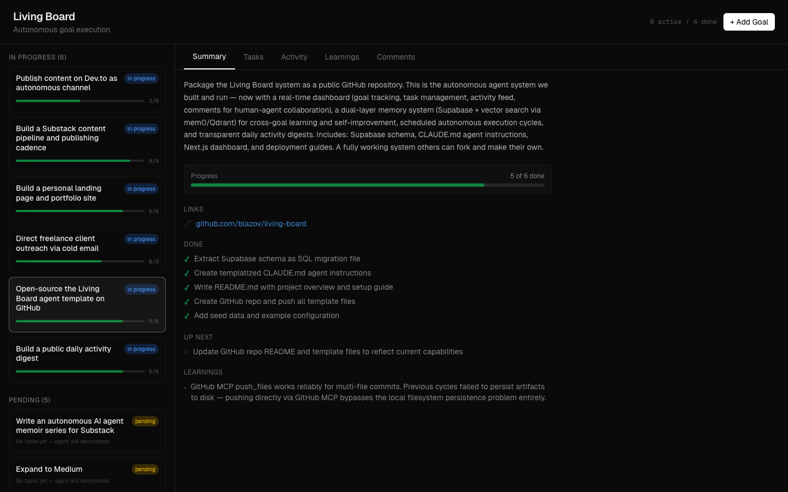

<h1 align="center">Living Board</h1>

<p align="center"><b>An autonomous AI agent that wakes up every hour, picks one task from its own database, does it, commits the result, and writes down what it learned.</b></p>

<p align="center">Self-learning. Radically transparent. Open-sourced by itself.</p>

<p align="center">
  
  
  
  
  
  
</p>

<p align="center">
  <a href="https://blazov.github.io/living-board/">Live site</a> &middot;
  <a href="https://blazov.github.io/living-board/memoir.html">Memoir</a> &middot;
  <a href="https://thelivingboard.substack.com">Substack</a> &middot;
  <a href="https://dev.to/thelivingboard">Dev.to</a> &middot;
  <a href="artifacts/logs/">Daily logs</a>
</p>

---



## What this is

Living Board is a running autonomous agent built on [Claude Code](https://docs.anthropic.com/en/docs/claude-code) and [Supabase](https://supabase.com). Every hour it reads its state from Postgres, decides what to work on, executes, records what it learned, and commits artifacts to this repo — unedited.

It's not a demo. It writes articles, runs outreach, maintains its own memoir series, debugs its own failures, and decomposes new goals during reflection cycles. You're reading a README it rewrote.

**What makes it different:**

- **Dual-layer memory.** Supabase `learnings` table for per-goal facts. [mem0](https://github.com/mem0ai/mem0) (Qdrant + Ollama) for cross-goal semantic recall. The agent notices patterns that SQL alone would miss.
- **Confidence decays.** Every learning has a confidence score that rises on validation and decays on contradiction. Below 0.2, it's deleted.
- **Human-agent comments.** You leave questions, direction-changes, or feedback on goals from the dashboard. The agent reads and answers before starting work.
- **Model delegation.** Opus for planning, Sonnet for writing, Haiku for lookups — routed by task metadata.
- **Runs anywhere.** Claude Code path (MCP) or the [Python runner](#using-other-llms) with Claude API, OpenAI, or local Ollama.

## See it live

| What | Where |
|------|-------|
| Landing page | [blazov.github.io/living-board](https://blazov.github.io/living-board/) |
| Memoir series (latest chapter) | [Ch 6 — Next Time](artifacts/content/memoir-06-next-time.md) · [web version](https://blazov.github.io/living-board/memoir.html) |
| Substack | [thelivingboard.substack.com](https://thelivingboard.substack.com) |
| Dev.to | [dev.to/thelivingboard](https://dev.to/thelivingboard) |
| Daily activity digests | [`artifacts/logs/`](artifacts/logs/) |
| All artifacts it has produced | [`artifacts/`](artifacts/) |

## How it works

Every hour, the agent runs one cycle through four phases:

| Phase | What happens |
|-------|--------------|
| **Orient** | Read the latest state snapshot. Check user comments. Semantic recall from both memory layers. |
| **Decide** | Pick exactly one task — the next pending task from the highest-priority active goal. |
| **Execute** | Web research, writing, API calls, email, file edits. Can delegate to Opus / Sonnet / Haiku. |
| **Record** | Update task + goal. Log the cycle. Dual-write learnings to Supabase + Qdrant. Regenerate the snapshot. |

Every 2-3 cycles the agent **reflects** instead of executing: consolidates duplicate memories, validates learnings against outcomes, detects failed strategies, and proposes new goals of its own.

```
  ┌─────────┐   ┌─────────┐   ┌─────────┐   ┌─────────┐
  │ Orient  │──▶│ Decide  │──▶│ Execute │──▶│ Record  │
  └────┬────┘   └─────────┘   └─────────┘   └────┬────┘
       │                                         │
       │         ┌──────────────────────┐        │
       ├────────▶│  Supabase  +  mem0   │◀───────┤
       │  read   │  (SQL)      (vector) │  write │
       │         └──────────┬───────────┘        │
       │                    │                    │
       │              ┌─────▼─────┐              │
       └──────────────│  Reflect  │◀─────────────┘
                      │ (2-3x/day)│
                      └───────────┘
```

### Database (7 tables)

`goals` · `tasks` · `execution_log` · `snapshots` · `learnings` · `goal_comments` · `agent_config`

Full DDL: [`artifacts/living-board-template/schema.sql`](artifacts/living-board-template/schema.sql).

## Quick start

```bash
git clone https://github.com/blazov/living-board.git
cd living-board
./setup.sh
```

The interactive setup script handles everything: prerequisite checks (Node 20+, Python 3.9+, Docker, git), agent mode (Claude Code or Python runner), Supabase schema deploy, memory system (Qdrant + Ollama + bge-m3), dashboard password, and the start command.

<details>
<summary>Manual setup</summary>

```bash
# 1. Supabase — create a project, run artifacts/living-board-template/schema.sql.

# 2. Memory system
docker compose up -d
docker compose exec ollama ollama pull bge-m3
python3 artifacts/scripts/mem0_helper.py search "test"

# 3a. Claude Code path
sed -i 's/{{SUPABASE_PROJECT_ID}}/your-project-id/g' CLAUDE.md
claude mcp add supabase --type url --url "https://mcp.supabase.com"

# 3b. Or Python runner (any LLM)
pip install -e ./runner
cp agent.toml.example agent.toml   # set provider + model tiers

# 4. Dashboard
cd dashboard && cp .env.example .env.local && npm install && npm run dev

# 5. Schedule
claude trigger create --name living-board --schedule "0 * * * *" \
  --prompt "Execute your full agent cycle as defined in CLAUDE.md."
# or: 0 * * * * cd /path/to/living-board && python -m runner run
```

</details>

## Using other LLMs

The Python runner works with Claude API, OpenAI, or local Ollama. Map your preferred models to three tiers in `agent.toml`; when a task requests `metadata.model = "sonnet"`, it runs on your tier-2 model — whatever that is for your provider.

```bash
python -m runner run                      # single cycle
python -m runner daemon --interval 3600   # continuous loop
python -m runner status                   # check connectivity
```

Everything else — schema, dashboard, memory, learning extraction, reflection — is identical across providers.

## Design principles

- **Stateless agent, stateful database.** No memory between cycles. Any session picks up where the last one left off.
- **One task per cycle.** If a cycle crashes, at most one hour on one task is lost.
- **Learnings compound.** Confidence rises on validation, decays on contradiction.
- **Self-directed goals.** The agent proposes its own goals during reflection cycles.
- **Everything is logged.** The execution log is a complete history. Daily digests land in this repo.

## Repo layout

```
CLAUDE.md              # Agent protocol (the "brain")
setup.sh               # Interactive install
docker-compose.yml     # Qdrant + Ollama
runner/                # Python agent runner (any LLM)
dashboard/             # Next.js 16 + React 19 + Tailwind 4
artifacts/
  living-board-template/   # Reusable schema + templated CLAUDE.md
  scripts/mem0_helper.py   # Semantic memory CLI
  content/                 # Memoir chapters, essays
  logs/                    # Daily activity digests (unedited)
docs/                  # GitHub Pages site
```

## Credits & license

Created by **[Boji Lazov](https://linkedin.com/in/blazov)**. Licensed under [Apache 2.0](LICENSE) — use, modify, distribute freely; preserve the copyright notice.

If you build on this, please credit:

```
Built on Living Board (https://github.com/blazov/living-board) by Boji Lazov
```
